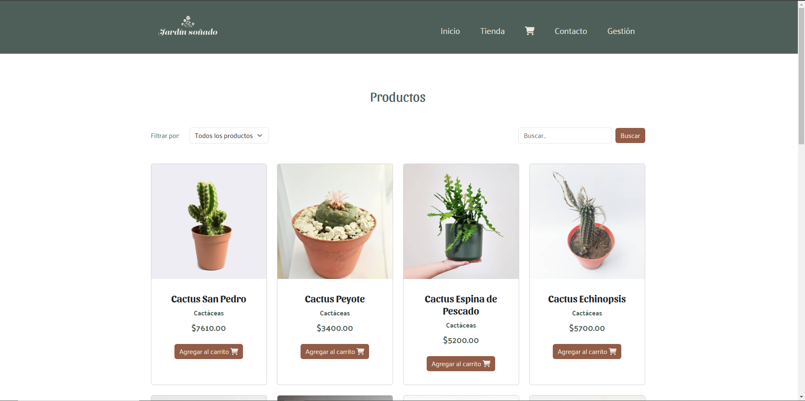

# 🌿 Jardín Soñado

**Jardín Soñado** es un sitio web creado con Vue.js, diseñada para ofrecer a los usuarios una experiencia interactiva en la compra de plantas. Este proyecto es parte de una consigna académica y destaca por su diseño amigable y funcionalidades avanzadas.

## 🚀 Funcionalidades

- **Catálogo Interactivo:** Explora una variedad de productos con imágenes y precios.
- **Carrito de Compras:** Añade productos al carrito y visualiza los totales en tiempo real.
- **Formulario de Contacto:** Permite a los usuarios enviar consultas personalizadas.
- **Panel Administrativo (ABM):** Gestión completa de productos para administradores.
- **Persistencia de Datos:** Los datos se almacenan en una base de datos MySQL y localStorage.

## 🛠️ Tecnologías

Este sitio fue desarrollado utilizando:

- **Frontend:**
  - [Vue.js](https://vuejs.org/) - Framework principal.
  - Vue Router - Navegación entre vistas.
  - Directivas como `v-bind`, `v-model`, `v-if`, `v-for`, entre otras.
  - Bootstrap 5 - Para estilos y diseño responsivo.

- **Backend:**
  - PHP con conexión PDO.
  - MySQL - Base de datos para productos.